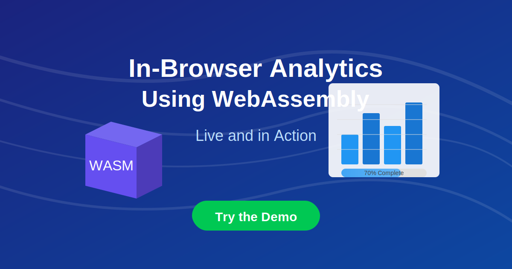

# In-Browser Analytics Using WebAssembly



A demonstration of performing complex data analytics directly in the web browser using WebAssembly and DuckDB-WASM.

## Live Demo

You can see the live demo here: [https://yourusername.github.io/in-browser-analytics](https://yourusername.github.io/in-browser-analytics)

## Features

- **WebAssembly-Powered Database**: Uses DuckDB compiled to WebAssembly for high-performance SQL analytics
- **Zero Server Requirements**: All processing happens directly in the browser
- **Real-Time Progress Tracking**: See the progress of data generation and analysis
- **Web Worker Implementation**: Non-blocking UI that remains responsive during intense computation
- **Interactive Visualizations**: Results displayed as interactive charts and tables
- **Large Dataset Handling**: Can process up to millions of rows directly in the browser

## How It Works

This demonstration showcases how WebAssembly enables sophisticated data processing directly in web browsers:

1. **WebAssembly Database**: DuckDB is compiled to WebAssembly and runs in the browser
2. **Background Processing**: A Web Worker runs DuckDB operations in a separate thread
3. **Batch Processing**: Data is generated and processed in batches with progress reporting
4. **Real-Time Visualization**: Results are displayed using Chart.js

## Getting Started

### Prerequisites

- A modern web browser that supports WebAssembly
- A local web server for development (e.g., `python -m http.server`)

### Running Locally

1. Clone this repository:
   ```bash
   git clone https://github.com/yourusername/in-browser-analytics.git
   cd in-browser-analytics
   ```

2. Start a local web server:
   ```bash
   # Using Python (recommended)
   python -m http.server
   
   # Using Node.js
   npx serve
   ```

3. Open your browser and navigate to `http://localhost:8000`

## Deployment

This project can be easily deployed to GitHub Pages:

1. Push the repository to GitHub
2. Go to Settings > Pages
3. Select the branch to deploy (usually `main` or `master`)
4. Your site will be available at `https://yourusername.github.io/in-browser-analytics/`

## Technology Stack

- **DuckDB-WASM**: In-browser analytical SQL database
- **WebAssembly**: Near-native speed code execution in the browser
- **Web Workers API**: Background thread processing
- **Chart.js**: Interactive data visualizations
- **Modern JavaScript**: ES6+ features

## Use Cases

- **Data Privacy**: Process sensitive data without sending it to servers
- **Embedded Analytics**: Add powerful analytics to web applications
- **Offline Capabilities**: Run analytics without internet connection
- **Edge Computing**: Push computation to the client device
- **Reduced Infrastructure**: Eliminate the need for analytics servers

## Contributing

Contributions are welcome! Please feel free to submit a Pull Request.

## License

This project is licensed under the MIT License - see the LICENSE file for details.

## Acknowledgments

- [DuckDB](https://duckdb.org/) team for creating an amazing analytical database
- [DuckDB-WASM](https://github.com/duckdb/duckdb-wasm) for bringing